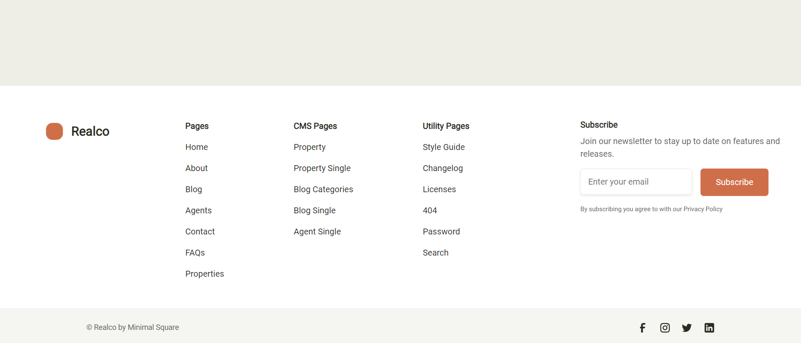

# Командный проект №1. Сайт компании по недвижимости **"Realco"**
Компания Realco - агенство недвижимости в Северной Америке, предлагающее свои услуги в городах-миллиониках США (Нью-Йорк, Лос-Анджелес, Лас-Вегас, Сан-Диего и др.)
### Проект выполнен на основе [макета](https://www.figma.com/design/kEVO5l8dmhI80RdChSpAEn/Realco?node-id=0-1) графического редактора Figma
### и реализован на базе технологий `html5`, `css3` и фреймворка `bootstrap5`

 
### При написании кода был использован семантический подход к разметке
 

### Сайт интерактивен и удобен для пользователя
 

### Сайт адаптирован под разные виды устройств (desktop, tablet, mobile):

* Desktop 

* Mobile  
  

### Команда разработчиков проекта:
* MariaLukyanova
* AlenaGorina
* NadezhdaKov
* Basulka
* Helen1553

#### <u>**Работа с репозиторием GIT**</u>
* <i>Клонирование репозитория:</i>
  1. Переходим в нужный репозиторий и нажимаем на кнопку "<>Code"
  2. Копируем ссылку
  3. Создаём папку для проекта на рабочем столе
  4. В этой папке в адресной строке пишем `cmd` - появляется терминал
  5. В терминале набираем команду `git clone "ссылка на репозиторий" .`
  6. Далее работаем с этой папкой уже в vscode

